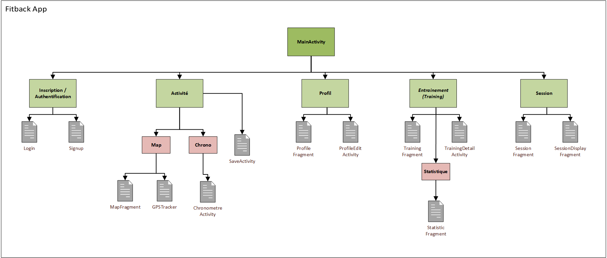

# Fitback

Fitback est une application Android développée dans le cadre d'un projet universitaire permettant de suivre son activité physique.

## Développeurs
- Faizan MOUHAMAD
- Dhinesh SATTIA
- Valentin DESSEUX

## Structure du projet

[Structure de l'application](fitback-structure.png)

## Fonctionnalités de l'application
- Créer un compte
- Compléter / accéder / éditer son profil
- Lançer une activité utilisant un chronomètre et une carte
- Créer/enregistrer son activité
- Indiquer son niveau de douleur avant/après l'effort
- Définir la nécessité de la géolocalisation pour une activité créée
- Créer/enregistrer une session
- Accéder à l'ensemble des entrainements et sessions
- Supprimer ses activités / sessions
- Accéder aux statistiques des activités réalisés en fonction des douleurs définies

## Trello

[Trello](https://trello.com/b/OFdXoJCR/fit-back)

## Javadoc

Pour visualiser la Javadoc, il faut ouvrir le fichier index.html situé dans le répertoire /javadoc en local.

[Javadoc](javadoc/index.html)